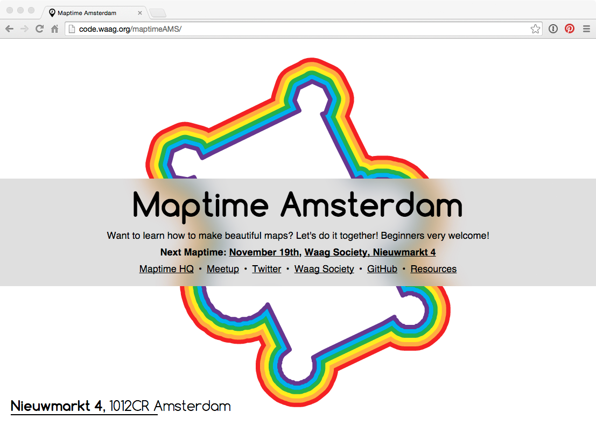

# Maptime Amsterdam

> Want to learn how to make beautiful maps? Let's do it together! Beginners very welcome!

This repository contains the [website](http://code.waag.org/maptimeAMS), resources and presentations for Maptime Amsterdam.

For more information about Maptime, see [Maptime HQ's website](http://maptime.io/).



## Buildings GeoJSON

To create the GeoJSON file containing [buildings data](/data/buildings.json), do the following:

- Download [BAG data file](http://geodata.nationaalgeoregister.nl/inspireadressen/atom/inspireadressen.xml) (1.3 GB)
- Import data into PostgreSQL/PostGIS database with NLExtract's [Bag-extract](http://nlextract.readthedocs.org/en/latest/bagextract.html)
- Create buildings table:

```sql
CREATE SCHEMA bert; -- Yes, you need this schema 😑

CREATE TABLE bert.panden_amsterdam AS SELECT
  p.identificatie::bigint, bouwjaar::int,
  ST_Transform(p.geovlak, 4326) AS geom,
  openbareruimtenaam, huisnummer, huisletter, huisnummertoevoeging, postcode
FROM verblijfsobjectactueelbestaand v
JOIN verblijfsobjectpandactueel vp
  ON vp.identificatie = v.identificatie
JOIN pandactueelbestaand p
  ON vp.gerelateerdpand = p.identificatie
JOIN nummeraanduidingactueelbestaand na
  ON v.hoofdadres = na.identificatie
JOIN openbareruimteactueelbestaand obr
  ON na.gerelateerdeopenbareruimte = obr.identificatie
JOIN woonplaatsactueelbestaand wp
  ON obr.gerelateerdewoonplaats = wp.identificatie
 WHERE wp.identificatie = 3594
```

- Run `ruby buildings.rb`
